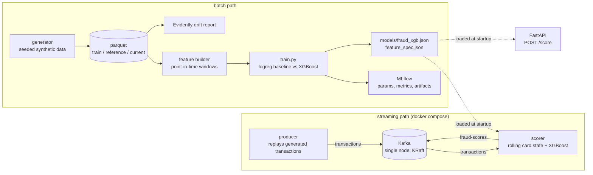

# realtime-fraud-ml

[](https://github.com/abbas1123/realtime-fraud-ml/actions/workflows/ci.yml)

ML scoring layer for a card-transaction stream. It is the continuation of
[realtime-transaction-analytics](https://github.com/abbas1123/realtime-transaction-analytics),
where fraud is caught with hand-written Kafka Streams rules such as velocity windows and geo
checks. Rules are cheap and explainable but every new pattern means new code, so this
repo learns the patterns instead: an XGBoost model trained on point-in-time card features, served
both over HTTP and as a Kafka consumer, with MLflow experiment tracking and Evidently drift
monitoring around it. All data comes from a seeded synthetic generator that injects four labeled
fraud patterns into otherwise ordinary card traffic.

## Architecture



The generator simulates users anchored to home regions, merchants with MCC categories and
log-normal ticket sizes, then injects labeled fraud: card-testing bursts (many tiny rapid
payments), stolen-card geo jumps (impossible travel), amount outliers vs the card's own history,
and high-velocity spending sprees.

## Features

Nine features per transaction, all computed strictly from the card's *earlier* transactions
(window semantics `[t - w, t)`), so nothing from the future leaks into training. The test suite
asserts hand-computed values on a small frame, proves truncation invariance (removing later
transactions never changes earlier features), and checks that the streaming tracker reproduces
the batch pipeline bit for bit.

| feature | meaning |
| --- | --- |
| `amount`, `log_amount` | raw and log1p ticket size |
| `txn_count_1h`, `txn_count_24h` | prior transactions on this card in the window |
| `amount_zscore` | amount vs the card's own history (mean/std of past amounts) |
| `seconds_since_last_txn` | gap to the previous transaction, capped at 7 days |
| `is_new_merchant` | card has never paid this merchant before |
| `geo_distance_km` | haversine distance from the card's previous transaction |
| `is_night` | UTC hour in 0-5 |

## Quickstart (local)

```
python -m venv .venv
.venv\Scripts\activate              # Windows; on Linux/macOS: source .venv/bin/activate
pip install -r requirements.txt -r requirements-ci.txt
pip install -e . --no-deps

pytest -q                           # 22 tests, no Kafka or Docker needed
python -m fraud_ml.data.generator --out-dir data --n-transactions 400000
python -m fraud_ml.train --data data/train.parquet --models-dir models
uvicorn fraud_ml.serve:app --port 8000
```

Training logs runs to a local SQLite-backed MLflow store (`mlruns/`, gitignored):
`mlflow ui --backend-store-uri sqlite:///mlruns/mlflow.db`.

## Quickstart (docker compose)

```
docker compose up --build
```

Four services: `kafka` (single-node KRaft), `producer` (generates 20k transactions and replays
them into the `transactions` topic at 50 events/s), `scorer` (consumes, keeps rolling per-card
state, scores with the committed model, produces to `fraud-scores`), and `api` on port 8000.
Watch scores come out:

```
docker compose exec kafka /opt/kafka/bin/kafka-console-consumer.sh \
  --bootstrap-server localhost:19092 --topic fraud-scores --from-beginning --max-messages 5
```

## Scoring API

`POST /score` takes the feature vector for one transaction (the stream scorer computes these
features itself; over HTTP you supply them):

```
curl -s localhost:8000/score -H "content-type: application/json" -d '{
  "transaction_id": "tx000123456",
  "amount": 1899.00,
  "txn_count_1h": 3,
  "txn_count_24h": 5,
  "amount_zscore": 7.4,
  "seconds_since_last_txn": 1260,
  "is_new_merchant": 1,
  "geo_distance_km": 2612.5,
  "is_night": 1
}'
```

```json
{
  "transaction_id": "tx000123456",
  "fraud_probability": 0.999803,
  "decision": "review",
  "threshold": 0.5,
  "top_features": [
    {"feature": "txn_count_1h", "contribution": 3.169},
    {"feature": "amount", "contribution": 3.0332},
    {"feature": "is_night", "contribution": 2.5079}
  ]
}
```

`top_features` are XGBoost `pred_contribs` values - per-feature contributions to the log-odds
for this exact prediction, no SHAP dependency needed. The decision threshold comes from config
(`FRAUD_THRESHOLD` env var, default 0.5). `GET /healthz` reports whether the model loaded.

## Model and evaluation

Trained on 400k generated transactions (2.0% fraud), split by time: first 80% train, last 20%
validation (80k rows, 1.85% fraud) - no shuffling across the time boundary. Class imbalance is
handled with `class_weight="balanced"` for the baseline and `scale_pos_weight` (48.1) for
XGBoost. Numbers below are from the validation window of that run; the trained model and its
feature spec are committed under `models/`.

| model | ROC-AUC | PR-AUC | precision@top-1% |
| --- | ---: | ---: | ---: |
| logistic regression (baseline) | 0.9845 | 0.8303 | 0.980 |
| XGBoost | 0.9955 | 0.9455 | 1.000 |

ROC-AUC is a weak signal here: with 98% negatives a model can look near-perfect while being
useless at the operating point. PR-AUC tracks precision against recall on the minority class -
the baseline drops to 0.83 while XGBoost holds 0.95, which is the real gap between them.
Precision@top-1% answers the operational question: if analysts can review 1% of traffic, what
share of it is actually fraud.

Take the absolute numbers with a grain of salt - the injected fraud patterns are cleaner than
real-world fraud, so every metric is optimistic. See Limitations.

Reproduce: the quickstart commands above, seed 42 end to end.

## Drift monitoring

`data/current.parquet` is generated with a deliberate behavior shift (larger ticket sizes, more
online spend, more travel and night activity). The report compares model-input feature
distributions between reference and current using Evidently's `DataDriftPreset`:

```
python -m fraud_ml.drift.report --reference data/reference.parquet --current data/current.parquet
```

The last generated run is committed: [reports/drift_report.html](reports/drift_report.html)
(interactive) and [reports/drift_summary.md](reports/drift_summary.md) (table). Result: 3 of 9
features drifted - `amount` (0.231), `log_amount` (0.309) and `geo_distance_km` (0.232) crossed
the 0.1 normed-Wasserstein threshold, which matches the shifts the generator injected. Velocity
features stayed put, as they should: the drift config does not touch transaction pacing.

## Tests and CI

`pytest -q` runs 22 tests without Kafka, Docker, MLflow or Evidently: generator determinism and
label sanity, exact expected feature values, the no-leakage truncation check, batch/stream
feature parity, a training smoke test that must beat a trivial baseline by a wide margin, and
the scoring API through the committed model. CI (GitHub Actions, `ubuntu-latest`, Python 3.12)
installs `requirements-ci.txt` - a slim pin set without the streaming and monitoring extras -
then runs `ruff check` and `pytest`.

## Limitations

- The data is synthetic. Injected fraud is separable by design, so metrics (especially
  precision@top-1% = 1.0) say as much about the generator as about the model. On real traffic
  expect far lower precision and a serious threshold-tuning exercise.
- The stream scorer keeps per-card state in process memory: restarts lose history and scaling
  beyond one consumer requires partition-sticky state, which is not implemented.
- Single-node Kafka in KRaft mode, one partition per topic - a demo topology, not a deployment.
- The decision threshold is a config default (0.5), not calibrated against a review budget or
  cost matrix.
- Ground-truth labels ride along the stream purely so you can eyeball scores against them; a
  real pipeline would join labels much later, from chargeback data.

## Roadmap

- Calibrate the threshold against an explicit review-budget constraint instead of 0.5.
- Move card state to Redis so the scorer survives restarts and can scale by partition.
- Run the Java rules engine and this scorer side by side on the same topic and compare
  catch rate per alert.
- Schedule the drift report as a job with alerting instead of a manual command.

## License

MIT
